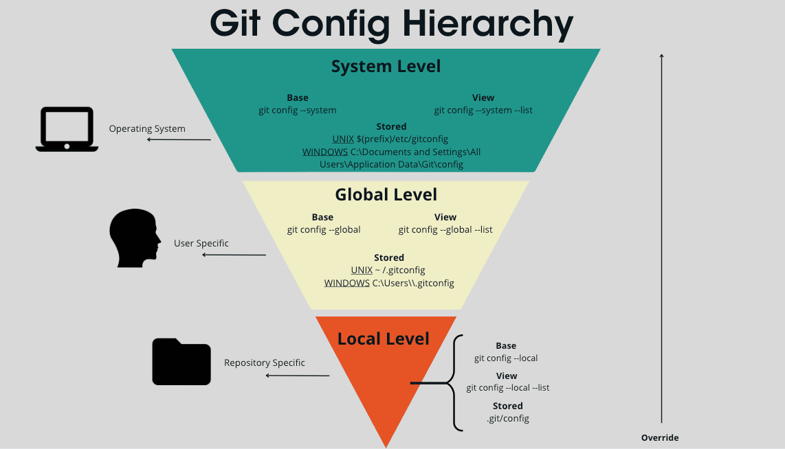

# Dia 1
## ¿Qué es git?
Git es un sistema de control de Versiones Distribuido(VCS), esto quiere decir
que se puede trabajar en grupo.
Nos permite guardar archivos y las versiones de estos a lo largo del tiempo
de manera local
## ¿Cómo nació git?
Git nació en 2005 cuando Linus Torvalds, creador del kernel de Linux,
 necesitó una nueva herramienta para gestionar los cambios en el código 
del proyecto Linux. Antes utilizaban un sistema llamado BitKeeper,
 que era un software propietario que les permitía trabajar gratis,
 pero tras un conflicto con la empresa que lo desarrollaba,
 dejaron de tener acceso a él.
 Como solución,
 Linus decidió crear su propio sistema de control de versiones desde cero,
 diseñado para ser rápido, seguro y permitir que muchos desarrolladores
 trabajaran al mismo tiempo. Así surgió Git, que con el paso de los años se
 convirtió en el sistema de control de versiones más utilizado en el mundo del
 desarrollo de software.
## ¿Cómo instalar git?
Para instalar git, se tiene que ir a la pagina web de git, y seguir los 
pasos de instalacion recomendados y luego para verifivar la correcta instalacion
se escribe **git --version** en la terminal
## Configuraciones básicas
- git config --global user.name "Tu nombre"
- git config --global user.email "tu@correo.com"
- git config --global core.autocrlf true
## Archivos que todo repositorio deberia tener
- README.md
- .gitignore
# Día 2-States y commits
## Los estados de git
### Directorio de trabajo(modificado)
Tu carpeta local.Estás escribiendo código, pero Git aún no lo tiene "asegurado".
### Stage Area(preparado)
EL area de espera.Le dices a Git: "Esto es lo que quiero guardar".
### Repositorio local(confirmado)
El  historial.Tus cambios ya tienen un ID(hash) y son parte de la historia.
![flujo de git] (captura.png)
## Directorio de trabajo(modificado)
Este es tu carpeta común, con la diferencia que GIT observa tus
archivos, y los cataloga en:
### Untracked 
Es decir sin seguimiento, que lo ve pero no tiene una
version antigua de este archivo, sucede cuando este es creado.
### Modified 
Es cuando GIT ya tiene una version previa del archivo y lo
modificaste, eliminaste o cambiaste de nombre.
Cualquier archivo que no este en el .gitignore pasa automaticamente a
uno de estos estados dependiendo que hayas hecho.
 - El comando **git log -- oneline** sirve para mostrar el commit resumido
  -EL comando **git restore <archivo>**, sirve para volver el archivo a su estado original,
  Esto borra fisicamente lo que escribimos
  - Si queremos que el archivo que creamos git lo ignore, creamos el archivo .gitignore 
y dentro escribimos los nombres de los archivos a ignorar
## Stage area(Preparado)
Permite seleccionar qué archivos modificados se incluirán en el siguiente commit(guardado)
y cuáles no.
Para traer un archivo al stage area se debe realizar lo siguiente:
-git add<archivo>: Agrega el archivo <archivo>, lo hace uno por uno
- git add. agrega todos los archivos observados por git
Si quieres sacar un archivo del stage area para volver al estado anterior:
**git restore --staged <archivo>**
## Repositorio Local(confirmado)
Esta es la ultima fase, aqui es donde le decimos al repositorio que cree
el punto de guardado para que todos los cambios que estan en staged
pasen a ser parte del historial
git commit -m "mensaje"
- **git reset --soft HEAD~1** es para deshacer el ultimo commit(usarlo con precaución)

## Buenas practicas
### ¿Cada cuanto debo hacer un commit?
Aquí usaremos los commits atómicos. Son una práctica
en Git donde cada confirmación (commit) representa un
único cambio lógico, pequeño y completo en el código
fuente.
A menudo. Es mejor hacer commits pequeños, agrupando
pequeñas mejoras o acciones, que un commit con todo lo
que se quiere hacer.
Hacer commit a menudo no significa que debas hacer
commits sin sentido. Graba tus progresos en iteraciones
pequeñas pero que tengan un significado y que, si puede
ser,
no deje tu aplicación o proyecto sin funcionar.
##Escribe buenos commits
Un commit debe describir lo que hace en pocas palabras y de manera simple pero efectiva:
1. Usa verbos imperativos (Add, Change, Fix, Remove)
Add: Significa que se añade un nuevo archivo.
Change: Significa que se modifica un archivo existente.
Fix: Significa que se arregla un bug.
Remove: Significa que se elimina un archivo existente.
2. No uses punto final ni puntos suspensivos en tus mensajes
Usar puntuación, más allá de las comas, es innecesario a la hora de crear un buen mensaje
de commit. Cada carácter cuenta a la hora de describir un cambio, así que no lo
desperdicies con puntos 
git commit -m “Add new search feature.” MAL. No uses punto final
git commit -m “Fix a problem with topbar..” MAL. No uses puntos suspensivos
git commit -m “Change the default system color” BIEN
. Usa como máximo 50 caracteres:
Sé corto y conciso. Si tienes mucho que explicar es probable que tu commit contenga
demasiados cambios. ¿Puedes separarlo en diferentes commits? Pues entonces hazlo.
4. Usa un prefijo para tus commits para hacerlos más semánticos
Para que el historial sea legible y se sepa mas facilmente lo que se hace se usa este tipo de
commits:
Escribe buenos commits
git commit -m “<tipo de commit>: <descripción>”
Por ejemplo:
git commit -m “feat: Add new search feature”
### Prefijos
feat: para una nueva característica para el usuario.
fix: para un bug que afecta al usuario.
perf: para cambios que mejoran el rendimiento del sitio.
build: para cambios en el sistema de build, tareas de despliegue o instalación.
ci: para cambios en la integración continua.
docs: para cambios en la documentación.
refactor: para refactorización del código como cambios de nombre de variables o funciones.
style: para cambios de formato, tabulaciones, espacios o puntos y coma, etc; no afectan al
usuario.
test: para tests o refactorización de uno ya existente.
# Día 3

## GitHub

## ¿Qué es GitHub?

GitHub es una plataforma en la nube y red social para desarrolladores que permite alojar, gestionar y colaborar en proyectos de software utilizando Git.

---

## Git vs GitHub

- **Git**: Sistema de control de versiones que crea “puntos de guardado” (commits).
- **GitHub**: Plataforma donde se almacenan y comparten esos repositorios.

Git usa GitHub, pero no son lo mismo.

---

## SSH vs HTTPS

### HTTPS
- Al clonar o hacer push, pide autenticación constantemente.
- Puede requerir token.
- Es más molesto en el uso diario.

### SSH
- Usa una clave (key) para autenticar tu PC.
- No pide contraseña cada vez.
- Es más cómodo y recomendado.

Recomendación: usar SSH siempre que sea posible.

---

## Configuración SSH

En Linux o Git Bash (Windows):

ssh-keygen -t ed25519 -C "tu-correo@email.com"
## Crear un repositorio en Github
1.Vas a tu apartado de repositorios
en https://github.com/Tu-user?
tab=repositories y Click en “New”
2.Pones el nombre de tu repositorio,
y si quieres una descripción. Y
luego click en “Create Repository” 
##Conectar un repositorio local de Git existente con uno en Github
git remote add origin git@github.com:TuUser/TuRepo.git
/*Remote es la URL que apunta al servidor externo es decir a
tu repositorio externo creado en Github y Origin es
simplemente el apodo(nickname) que git le da por defecto a esa
URL*/

git branch -M main

git push -u origin main

NOTA: PARA ESTO YA TIENES QUE HABER INICIALIZADO EL REPO LOCAL
(git init) Y TENER UN COMMIT INICIAL AL MENOS (git add . + git
commit -m “Initial commit”)
## Clonar un repositorio de GIT
Para ello haces el comando:
git clone “git@github.com:TuUser/TuRepo.git”

Si por accidente lo hiciste con HTTPS:
git clone “https://github.com/TuUser/TuRepo.git”

Usa este comando para cambiar el puntero de github y no te
pida autenticación cada vez:
git remote set-url origin “git@github.com:TuUser/TuRepo.git”
/*Este comando también se usa si quieres cambiar el
repositorio remoto al cual esta conectado el repo*/

Si quieres ver a que repositorio remoto esta conectado tu
repo:
git remote -v
## Cambios 
### Subir mis cambios
git push origin <rama>
### Bajar los cambios
git pull origin <rama> 

# Día 4
## Git remote
git remote es el comando que nos permite gestionar nuestras conexiones con los repositorios
remotos, le dice a GIT local donde enviar o de donde traer la informacion, algunos comandos
utiles son:
- git remote -v(nos permite ver las URLs exactas donde apunta nuestro repositorio)
- git remote add <apodo> (este apodo es el apodo que pusimos a nuestro repositorio remoto), y nos permite vincular nuestro repo local con uno en la nube
-git remote set-url <apodo> "url" (Cambia la url donde apunta nuestro repositorio)
## MULTIPLES SSH
-Si tenemos mas de una cuenta de Github o necesitamos tener otras cuentas es util tener 
mas de una llave SSH, pues este nos da acceso a cada cuenta.
## COnfigurar Multiples SSH
 1. Generamos el sshkey en con otro nombre
 2. Creamos un archivo config para que no choquen las key
   # Cuenta Personal (la de siempre)
Host github.com
HostName github.com
User git
IdentityFile ~/.ssh/id_ed25519
Host github-miname
HostName github.com
User git
IdentityFile ~/.ssh/id_miname
**Especificaciones de los parametros**
Host: Es el apodo o alias que le pones a la
conexión. Es lo que escribes en la terminal
después de git@.
HostName: Es la dirección real del servidor
a donde nos conectamos. Siempre será
github.com
User: Es el nombre de usuario del sistema
remoto. Para GitHub, siempre, siempre es
git.
IdentityFile: Es la ruta exacta hacia la
"escalera" (la llave privada) que quieres
usar para ese Host específico.
3. verificamos si funciona 
  ssh -T git@github-miname
## Configuraciones locales
Las configuraciones locales se imponen a las globales, y
estas solo funcionan para el repositorio en el que se aplican.
Para hacer configuraciones locales lo que se debe hacer es
lo mismo que en las globales pero sin el flag --global:

git config user.name "Mi nuevo Name"
git config user.email "micorreo@gmail.com"
## Git Checkout
Es el comando que nos permite desplazar el HEAD
(nuestro puntero o "lector" actual) hacia un punto
específico de la historia o a una rama distinta.

¿Para qué sirve?
Inspeccionar: Ver cómo era el código en un
commit antiguo.
Restaurar: Recuperar archivos que borramos o
cambiamos.
Experimentar: Probar cambios sin arruinar la
rama principal.
Cambiar: Saltarnos de una rama a otra (ej. de
main a desarrollo).
## El estado "Detached HEAD"
Normalmente, el HEAD apunta a una Rama (que se
mueve). En estado desacoplado, el HEAD apunta
directamente a un Commit (que es fijo).

¿Que quiere decir?
Eres un espectador en el pasado.
Puedes ver todo y escribir notas, pero no tienes
"cuerpo" (rama).
Si te vas al presente sin "encarnar" en una rama,
tus cambios se pierden en el vacío.
## ¿Cómo ir y volver de un commit?
Para ir atras debes hacer:
git checkout <hash_antiguo>
Y para volver al ultimo hash de la rama
git checkout <rama>

Si hiciste algo aca (como un commit) desaparece
salvo que hagas:
git checkout <hash_commit_creado>
git checkout -b rama_nueva

# ⚙️ Jerarquía de Configuración de Git (Git Config Hierarchy)

## 🧠 ¿Qué es la jerarquía de configuración de Git?

La **jerarquía de configuración de Git** define **dónde se guardan las configuraciones** y **cuál tiene prioridad** cuando existen varias configuraciones al mismo tiempo.

Git utiliza **tres niveles de configuración**, cada uno con un alcance diferente:

1. 🖥️ System (Sistema)  
2. 👤 Global (Usuario)  
3. 📁 Local (Repositorio)  

Cada nivel puede **sobrescribir** la configuración del nivel anterior.

---

# 🖥️ Nivel System (Sistema)

## 📌 Descripción

El **nivel System** afecta **a todos los usuarios** del sistema operativo.

Este nivel normalmente es configurado por **administradores del sistema**.

 
# Dia 5
## ¿Qué es una rama en Git?
Una rama en Git es una línea independiente de desarrollo dentro de un proyecto
Permite trabajar en nuevas funcionalidades sin afectar
la versión principal del código
La rama principal suele llamarse Main
## ¿Para que sirven las ramas?

Las ramas permiten:

- Trabajar en nuevas funciones sin romper el programa principal
- Corregir errores sin afectar el código estable
- Permitir que varias personas trabajen al mismo tiempo
- Probar cambios antes de integrarlos al proyecto principal
## Comandos básicos para trabajar con ramas
### Ver ramas existentes
git branch
Muestra todas las ramas locales
### Crear una nueva rama
git branch nombre-rama
Crea la rama, pero no cambia a ella,¿.
### Cambiar de rama(checkout)
git checkout nombre-rama
### Crear y cambiar de rama en un solo comando
git checkout -b nombre-rama
### Nuevo comando moderno(switch)
git switch nombre-rama
Crear y cambiar 
git switch -c nueva-rama
### Eliminar una rama
git brach -d nombre-rama
## ¿Qué es gitflow?
Gitflow es un modelo de trabajo con ramas que define
cómo organizar el desarrollo de un proyecto
Sirve para:
- Organizar el trabajo en equipo
- Mantener el código ordenado
- Controlar versiones del software
## Estructuras de Gitflow
### Ramas principales
Main 
Contiene:
- Código listo para producción
- Versiones finales
Develop
Contiene:

- Código en desarrollo
- Integración de nuevas funciones
### Ramas auxiliares
**Feature**
Se crean desde: develop
Se usan para: 
Desarrollar nuevas funciones
**release**
Cuando preparas el lanzamiento de una nueva
versión. Es en teoria donde se hacen pruebas (QA).
Se crean en develop y se fusionan en develop o main

**Hotfix**

Para trabajar en cambios imprevistos como parches
para arreglar un bug o un problema en producción
Por eso, al crear una rama hotfix se debe hacer
desde la rama main ya que no se podría crear una
solución desde la rama develop ya que contiene
cambios que pueden ser inestables todavía.
Nacen de main y se fusionan con main o develop
# Dia 6
## ¿Qué es git merge?
GIt merge nos permite fusionar nuestras ramas en una
sola para que ambas tengan los commits hechos.
Se agrega no ff, lo cual hace que al unir la rama, hagamos un commit
para que no se pierda el historial de ramas,aun si  la borras.
## ¿Qué es git fetch?
Es un comando que consulta el repositorio remoto y descarga la información nueva, pero sin aplicarla a tu rama actual.
Te permite ver qué cambió antes de decidir integrarlo.
## ¿Qué es git pull?
Es el comando que obtiene los cambios del repositorio remoto y los integra automáticamente en tu rama actual.
En esencia, combina fetch + merge.
## ¿Qué es git push?
Es el comando que envía tus commits locales al repositorio remoto, actualizando la rama correspondiente.

El flag -u se usa la primera vez para establecer una relación entre tu rama local y la remota, evitando tener que especificarla en el futuro.
## Flujo de trabajo
Te posicionas en develop y la actualizas
 Garantizas que trabajas sobre la versión más reciente.
Cambias a tu rama (o la creas)
 Aíslas tu trabajo del resto del equipo.
Si develop cambió, integras esos cambios en tu rama
 Evitas conflictos después.
Realizas tus cambios y los subes
 Compartes tu progreso en el remoto.
Vuelves a develop y la actualizas otra vez
 Te aseguras de no sobrescribir cambios recientes.
Fusionas tu rama en develop usando --no-ff
 Dejas registro explícito de la integración.
Si hay conflictos, los resuelves manualmente y confirmas
 Defines qué versión del código se mantiene.
Eliminas tu rama
 Limpias el entorno de trabajo.
Subes develop actualizado al repositorio remoto
 El equipo obtiene los cambios finales.
# Dia 7
## ¿Qué son los pull request?
- Un Pull Request (PR) es una solicitud que haces en GitHub para proponer cambios en el código
 del proyecto.
## ¿Qué incluye un Pr?
- Cuando creas un PR, GitHub muestra:

Los cambios que hiciste (línea por línea)
Los archivos modificados
Los commits que agregaste
Comentarios del equipo
Revisiones (approve / request changes)
## ¿Cómo crear un Pull Request?
 1. Subir tu rama
  - git push origin feature/navbar
 2. Ir a Github
 - Entras al repositorio
GitHub te mostrará un botón:
 “Compare & pull request”
3. Crear el PR
Seleccionas:
base: develop
compare: feature/navbar
Agregas título y descripción
Clic en Create Pull Request
4. Revision 
El equipo puede:

✅ Aprobar (Approve)
❌ Pedir cambios (Request changes)
💬 Comentar
 5. Merge
Si todo esta bien:
## Flujo de trabajo con PRs
1. Actualizar develop
git checkout develop
git fetch
git pull origin develop
 Te aseguras de tener la última versión del proyecto
2. Crear o usar tu rama
git checkout rama
3. Sincronizar con develop
 git merge develop
4. Trabajas Normalmente
- Editas código
- Haces commits
5. Subir tu trabajo
- git push origin rama
## ¿Porque usar Pull Request?
### Problemas sin usar PRs
Cualquier persona puede romper el código sin darse cuenta
No hay revisión previa de los cambios
Se puede subir código incorrecto o incompleto
Falta de control sobre lo que se integra
Se dificulta el trabajo en equipo
## Ventajas de usar PRs
1. Revisión de código

Permite que otros revisen tu trabajo antes de aceptarlo.

2. Seguridad

Evita que alguien integre cambios sin aprobación.

3. Trabajo en equipo

Facilita la discusión y mejora de los cambios.

4. Historial claro

Permite ver quién hizo qué cambios y por qué.

5. Prevención de errores

Ayuda a detectar errores antes de integrar el código.
## ¿Cómo proteger el repositorio?
Incluso usando PRs, alguien podría hacer cambios directos si no hay restricciones.

Para evitar esto, se utilizan reglas de protección de ramas en GitHub.
### Branch protection rules
Se pueden configurar las siguientes reglas:

No permitir push directo a main o develop
Requerir aprobación antes de hacer merge
Obligar el uso de Pull Requests

